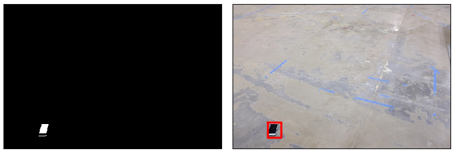
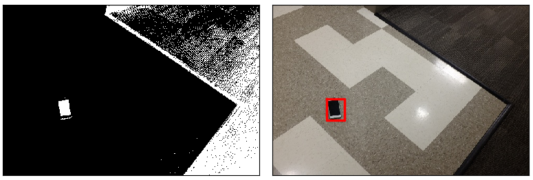
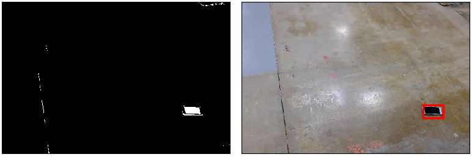

# Visual-Object-Detection-AI-Bot
## Visual Object Detection System Prototype
The task of the visual object detection system is to determine the location of a phone dropped on the floor. To detect the phone, pixel classification is performed using a supervised machine learning model, Multiclass Logistic Regression Model; then, image segmentation and phone shape recognition are performed to detect the phone and its location in an RGB image.

## Visual Phone Detection Results:




## OS Requirements:
Python 3 is required to run this repository, and several Python packages must be installed to run the program including openCV, matplotlib, numpy, pandas, scikit-image, and PyQt5 packages. The repository was tested with Python 3.7.6.

## Installation:
1.) Git clone the repository as shown below, or download and extract "Visual-Object-Detection-AI-Bot.zip" file.

```
git clone https://github.com/kaitheuser/Visual-Object-Detection-AI-Bot.git
```

2.) Install the dependencies and required Python packages.

```
pip install -r requirements.txt
```

3.) Change the directory to the "Visual-Object-Detection-AI-Bot" directory, where it is cloned and run the following command:

```
pip install -e .
```

## Instructions:
There are two executable python3 scripts to run the programs as presented below:

1.) *"train_phone_finder.py"* takes a single command line argument which is a path to a folder with labeled images and labels.txt that has been attached to this description. This script may generate any artifacts you want in the current folder. Here is what a terminal command will look like:

> python train_phone_finder.py ~/find_phone

2.) *"find_phone.py"* takes a single command line argument which is a path to the jpeg image to be tested. This script may use data in the local folder previously
generated by *"train_phone_finder.py"*. This script has to print the normalized coordinates of the phone detected on this test image in the format shown below. Here is what a terminal command will look like. Please, notice space separated float numbers on a single line without parentheses (!):

> python find_phone.py ~/find_phone_test_images/51.jpg

> Estimated Phone Normalized Pixel Coordinate: (0.2454, 0.6154)

> Accuracy Score: 100 %

A phone is considered to be detected correctly on a test image if your output is within a radius of 0.05 (normalized distance) centered on the phone.

## *"utils.py"* Description:
- load_txt() -> Load the labels text file and convert it into a data frame.
- sort_df() -> Sort the labels dataframe in an ascending order based on the image names.
- norm2pix_coords() -> Convert normalized coordinates to pixel coordinates.
- pix2norm_coords() -> Convert pixel coordinates to normalized coordinates.
- append_data() -> Append features and labels to X_train and y_train, respectively.
- extract_pixels() -> Extract all the black phone screen pixels from the labels dataframe.
- get_train_data() -> Compile and obtain all training data.

## Additional Folders and Files Added to Complete the Project.
1.) **"data_scraping"** folder (!!!**Note**: Please save the data from "data_scraping/data/" before running. Running it will override previous data.!!!)

a.) *"color_data_scraper.py"* is used to collect a portion of pixel values from the training images and to hand label them manually.

    i.) To run the script, open up the "color_data_scraper.py" from the "data_scraping" folder. 
    
    ii.) In line 41, there is a defined variable called "start_ID" that you can modify from 1 to 129. It will starts at the training images that you wanted to collect data from. For example, if "start_ID" is 2, it will start at "1.jpg" to collect data. Then, run the script.

    iii.) Select the Region of Interest (ROI) by left-clicking.

    iv.) To exit the task, just right-click the image.

    v.) Then, select a number from 1 to 15, which you think is the color.

    vi.) Type "Y" to continue select ROI in the same image, and repeat steps iii.) to v.). If not, type "N" to move to the next image.

    vii.) The process is repeated from iii.) to vi.) until the last image, which is "134.jpg"

    viii.) Data will be saved at "data_scraping/data/".

b.) *"test_data_loader.py"* is used to compiled data from **"data_scraping/data/"**  and save it at **"data_scraping/compiled_color_data/"** as a .csv file.

    i.) To run the script, open up the "test_data_loader.py" from the "data_scraping" folder. 

    ii.) Run the script.
    
    iii.) Data from from "data_scraping/data/" is complied and saved to "data_scraping/compiled_color_data/" as a .csv file.

## Future Improvements
Since the training labeled dataset is limited, the implemented visual object detection system uses multiclass logistic regression training model for the pixel classification, image segmentation and the shape recognition algorithm to detect phones instead of using PCA or CNN training model to recognized entire images of a phone. Although this visual object detection system prototype managed to detect phone more than 70 % on the provided labeled dataset, the performance can be further improve by optimizing the multiclass logistic regression parameters (i.e., learning rate, maximum number of iteration, error tolerance), image filtering parameters (dilation kernel size, dilation iterations, erosion kernel size, erosion iterations), and shape-recognition parameters (i.e., height-width ratio, segmented area). If there are more training labeled dataset, PCA or CNN training model can be implemented to recognized objects in an image better, which will definitely help to increase the detection accuracy.

In this project, only 6168 color pixels are collected, and the color pixels are collected from the first eight training images and. To better train the multi-class logistic regression model, it is important to collect the optimum amount of data and to minimize human error during the data collection process. Therefore, collecting
a huge amount of data could train the machine learning model to misclassify color pixels due to larger human error of mislabeling colors during the data collection process. Besides that, customers must ensure the collected training images must not be blurry to better train the model.

